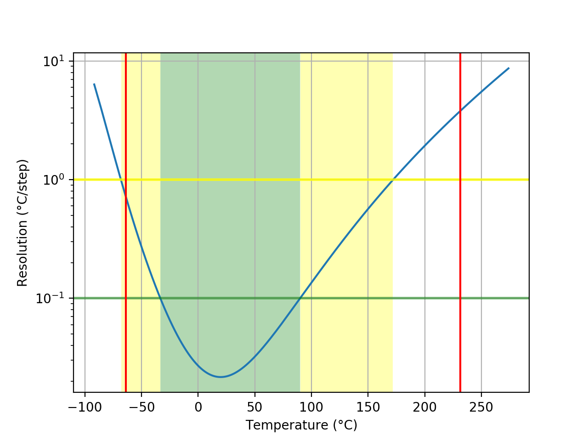
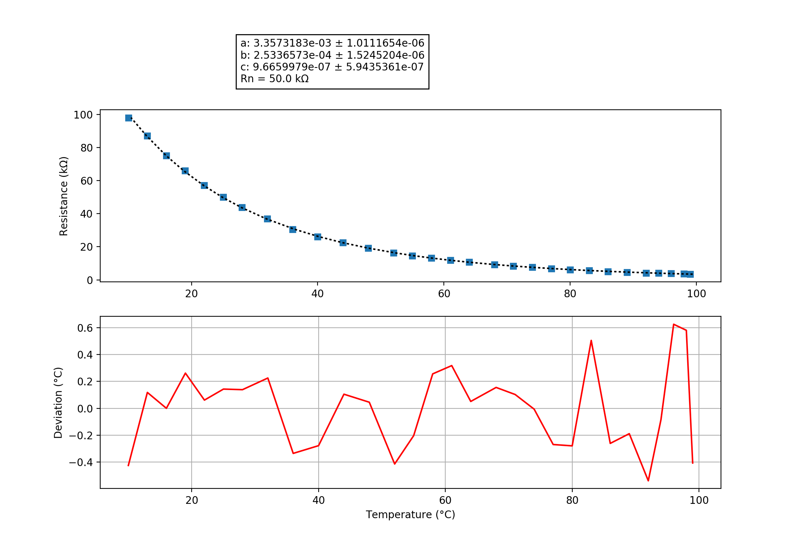

## pro05
### Probe performance data

Values based on 47k measurement resistor.

Property | Symbol | Value
-------- | -------- | --------
Resistance at 0°C | R0 | 166.17k
Resistance at 25°C | R25 | 49.68k
Resistance at 85°C | R85 | 5.29k
Beta 25°C to 85°C | B25/85| 3985K
Minimum measurable temperature | | -63.6°C
Minimum high-res temperature | | -33.3°C
Highest resolution || 2.17e-02°C/step at 19.9°C
Maximum high-res temperature | | 90.1°C
Maximum measurable temperature | | 231.3°C

### Probe curve data

Property | Symbol | Value
-------- | -------- | --------
Resistance near 25°C | R251 | 50.00k
Steinhart-Hart coefficient | a | 3.3573183e-03 ± 1.0111654e-06
Steinhart-Hart coefficient | b | 2.5336573e-04 ± 1.5245204e-06
Steinhart-Hart coefficient | c | 9.6659979e-07 ± 5.9435361e-07

1: The deviation between this R25 and the R25 shown above is not relevant, this R25 is taken from the original data point which is closest to 25°C. The value taken as a factor into the calculation of the final value and serves only a scaling purpose to the Steinhart-Hart coefficients.
