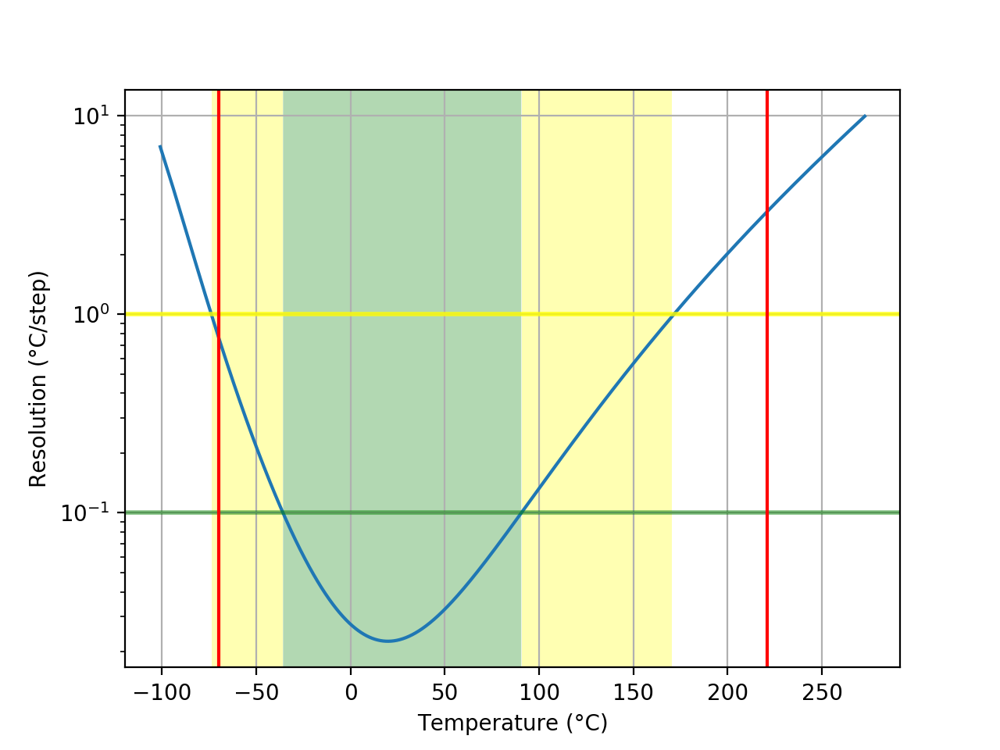
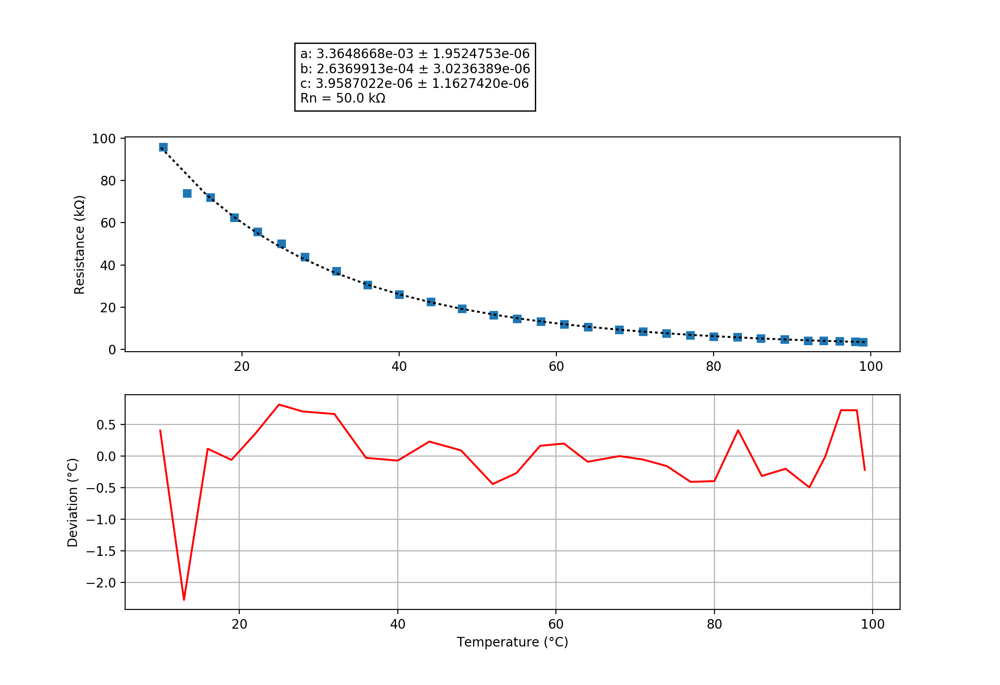

## data
### Probe performance data

Values based on 47k measurement resistor.

Property | Symbol | Value
-------- | -------- | --------
Resistance at 0°C | R0 | 152.03k
Resistance at 25°C | R25 | 48.29k
Resistance at 85°C | R85 | 5.31k
Beta 25°C to 85°C | B25/85| 3930K
Minimum measurable temperature | | -70.1°C
Minimum high-res temperature | | -35.8°C
Highest resolution || 2.26e-02°C/step at 19.8°C
Maximum high-res temperature | | 90.5°C
Maximum measurable temperature | | 220.8°C

### Probe curve data

Property | Symbol | Value
-------- | -------- | --------
Resistance near 25°C | R251 | 50.00k
Steinhart-Hart coefficient | a | 3.3648668e-03 ± 1.9524753e-06
Steinhart-Hart coefficient | b | 2.6369913e-04 ± 3.0236389e-06
Steinhart-Hart coefficient | c | 3.9587022e-06 ± 1.1627420e-06

1: The deviation between this R25 and the R25 shown above is not relevant, this R25 is taken from the original data point which is closest to 25°C. The value taken as a factor into the calculation of the final value and serves only a scaling purpose to the Steinhart-Hart coefficients.
